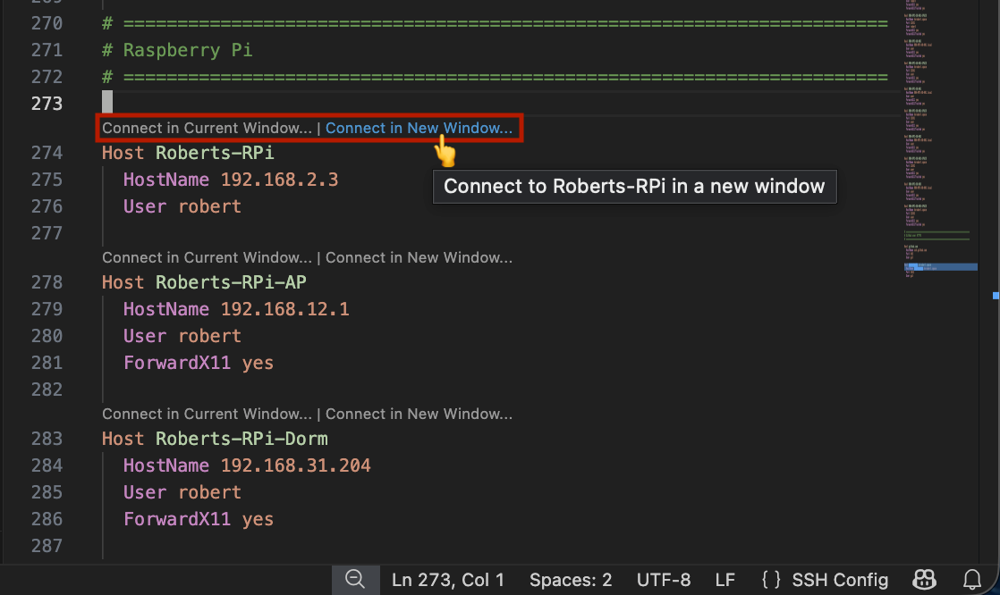

# SSH Config All-In-One

[](https://marketplace.visualstudio.com/items?itemName=HNRobert.vscode-ssh-config-all-in-one)
[](https://github.com/hnrobert/vscode-ssh-config-all-in-one)
[](LICENSE)
[](https://github.com/hnrobert/vscode-ssh-config-all-in-one/issues)
[](https://github.com/hnrobert/vscode-ssh-config-all-in-one/issues?q=is%3Aissue+is%3Aclosed)

> Enhanced SSH Config Language Server extension for Visual Studio Code. Provides autocompletion, syntax highlighting, formatting, go to include file definitions, hover support, and quick connection actions for SSH config directives.

## Features

- **SSH Host Explorer**: A dedicated activity bar panel that lists all your SSH hosts organized by config file, with inline actions to connect, edit, search, and manage hosts.
- **Quick Connect CodeLens**: Provides "Connect in Current Window..." and "Connect in New Window..." inline buttons above each `Host` declaration. Seamlessly connects to the server using the official `ms-vscode-remote.remote-ssh` extension.
  - 
- **Universal Formatter**: Formats your SSH config regardless of where it's opened (local, remote workspace, or even unsaved untitled files).
- **Autocompletion**: Provides rich suggestions as you type in an SSH config file.
- **Syntax Highlighting**: Enhanced and refined syntax grammar.
- **Hover Support**: Hover over any keyword to see a brief description of its function.
- **Go To Definition**: Supports clicking through `Include` statements.
- **Customizable Formatting**: Automatically indent directives under `Host` and `Match` blocks. Controlled via the `sshConfigAllInOne.format.indentSize` setting.

## Formatting Example

Before:

```properties
Host example
HostName ssh.example.com
User admin
Port 22
IdentityFile ~/.ssh/mykey
```

After (using default 2 spaces):

```properties
Host example
  HostName ssh.example.com
  User admin
  Port 22
  IdentityFile ~/.ssh/mykey
```

## Settings

- `sshConfigAllInOne.format.indentSize`: The number of spaces used for indentation when formatting `Host` and `Match` blocks. (Default: `2`)
- `sshConfigAllInOne.config.additionalFiles`: Additional SSH config file paths to show in the explorer. Supports `~` for home directory.
- `sshConfigAllInOne.config.excludeDefaultFiles`: Default SSH config file paths to exclude from the explorer.

## Acknowledgements

This project is deeply based on the fantastic work by [jamief](https://github.com/jamief) on [vscode-ssh-config-enhanced](https://github.com/jamief/vscode-ssh-config-enhanced). Thanks for providing the original repository and all of its underlying core language features.
